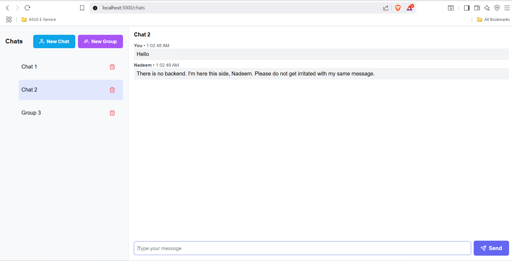

# Typeface Chat App

A modern frontend-only chat interface  — built with React, Redux, PrimeReact, and TypeScript.

## 🚀 Features

- Create group or private chats
- Send messages with timestamps
- Auto-reply from "Nadeem"
- Delete chats with confirmation
- Responsive UI using PrimeReact

## 🔧 Tech Stack

- React + TypeScript
- Redux Toolkit
- PrimeReact - A free component Library
- Webpack (manual setup)

## 🛠️ Setup

```bash
npm install
npm start
```


